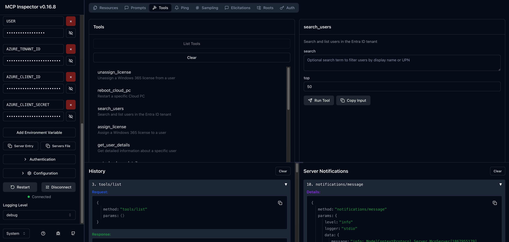
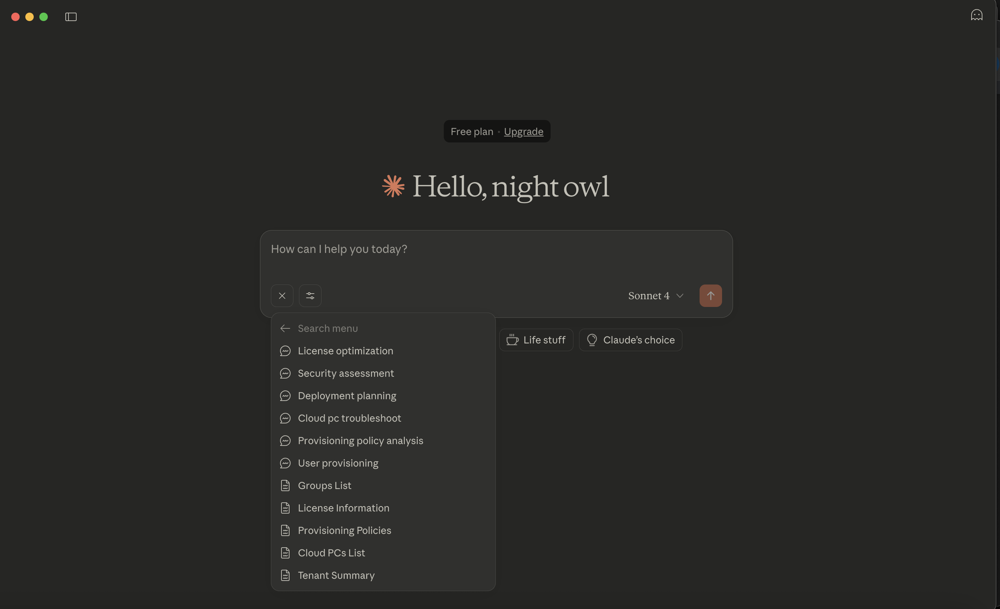
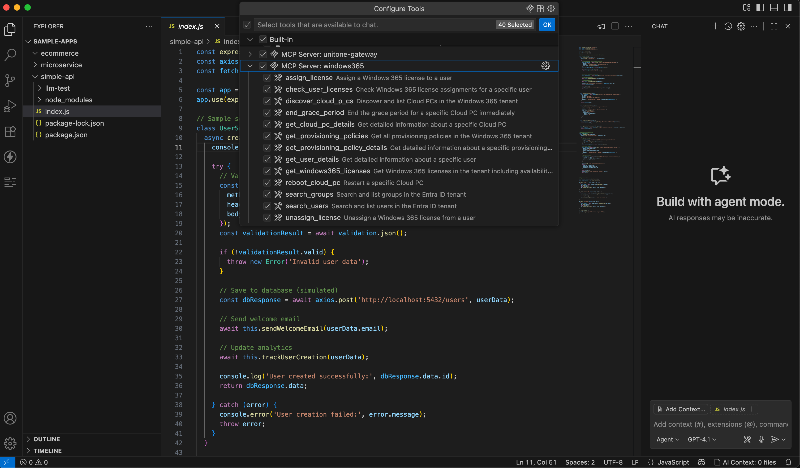

# Windows 365 MCP Server

[](https://dotnet.microsoft.com/download/dotnet/9.0)
[](https://opensource.org/licenses/MIT)
[](https://github.com/modelcontextprotocol/specification)
[](https://www.microsoft.com/en-us/windows-365)

⭐ **[Star this repository](https://github.com/unitone-ai/windows-365-mcp-server)** to stay updated with the latest features!

> **The FIRST Model Context Protocol (MCP) Server for Windows 365 Cloud PC management**

A comprehensive MCP server that enables AI assistants to discover, provision, and manage Windows 365 Cloud PCs through Microsoft Graph API. Built with C#/.NET and fully compliant with MCP specification 2025-06-18. Initial set of tools is provided, while we will continue building and providing tools. Initial release uses STDIO while future releases will also include Streamable HTTP as a transport.

## Table of Contents
- [What's Included](#-whats-included)
- [Key Features](#-key-features)
- [Prerequisites](#-prerequisites)
- [Quick Start](#-quick-start)
- [What You Can Do Now](#-what-you-can-do-now)
- [MCP Tools (AI Actions)](#️-mcp-tools-ai-actions)
- [MCP Prompts (Guided Workflows)](#-mcp-prompts-guided-workflows)
- [MCP Resources (Live Data)](#-mcp-resources-live-data)
- [Common Use Cases](#-common-use-cases)
- [Troubleshooting](#-troubleshooting)
- [Architecture](#️-architecture)
- [Authentication & Transport](#-authentication--transport)
- [Security & Compliance](#-security--compliance)
- [MCP Client Examples](#-mcp-client-examples)
- [Roadmap](#️-roadmap)
- [Testing & Validation](#-testing--validation)
- [Windows 365 Provisioning Flow](#-windows-365-provisioning-flow)
- [Contributing](#-contributing)
- [License](#-license)
- [About UNITONE](#-about-unitone)
- [Support & Community](#-support--community)

## ✨ What's Included

### 🛠️ **MCP Tools** (AI-Controlled Actions)
- **13 Tools**: Windows 365 discovery, monitoring, licensing, user management, and policy administration
- Comprehensive coverage of Windows 365 operations from read-only discovery to license assignments

### 💬 **MCP Prompts** (User-Guided Workflows)
- **6 Prompts**: Cloud PC troubleshooting, policy analysis, license optimization, deployment planning, user provisioning, security assessment
- Pre-built workflows for common Windows 365 scenarios

### 📊 **MCP Resources** (Real-Time Data Access)
- **7 Resources**: Cloud PCs list, individual PC details, provisioning policies, licenses, user licenses, groups list, tenant summary
- Live inventory, health monitoring, and documentation

### 🔧 **MCP Utilities**
- **Completion**: Windows 365-specific autocompletion for tools and prompts
- **Pagination**: Cursor-based pagination for large datasets
- **Logging**: Structured logging compliant with MCP standards

### 🔐 **Enterprise Security**
- **DefaultAzureCredential**: Secure authentication with multiple credential sources
- **STDIO Transport**: MCP-compliant communication protocol
- **Structured Logging**: All logs to stderr for proper MCP protocol separation

---

## 🚀 Key Features

- ✅ **Full MCP Compliance** - Complete implementation of MCP 2025-06-18 specification with official C# SDK
- ✅ **Zero-Config Discovery** - Automatic Cloud PC and license detection via Microsoft Graph API
- ✅ **Production Authentication** - DefaultAzureCredential with environment variable support
- ✅ **Real-Time Data** - Live Cloud PC inventory, policies, and license information
- ✅ **Enterprise Security** - Secure STDIO transport with structured logging
- ✅ **Production Ready** - Tested with real Windows 365 tenants and Graph API endpoints

## 📋 Prerequisites

- [.NET 9.0 SDK](https://dotnet.microsoft.com/download/dotnet/9.0)
- Windows 365 tenant with active subscriptions
- Entra ID App Registration with Microsoft Graph permissions

## ⚡ Quick Start

Follow these **exact steps** for successful setup:

### Step 1: Clone & Build Project
```bash
git clone https://github.com/unitone-ai/windows-365-mcp-server.git
cd windows-365-mcp-server
dotnet restore src/Windows365.Mcp.Server/Windows365.Mcp.Server.csproj
dotnet build src/Windows365.Mcp.Server/Windows365.Mcp.Server.csproj
```

### Step 2: Configure Entra ID App Registration
1. Go to [Azure Portal](https://portal.azure.com) → **App registrations** → **New registration**
2. **Name**: `Windows 365 MCP Server`
3. **Redirect URI**: Leave blank (not needed for STDIO transport)
4. After creation, go to **API permissions** and grant these **Application** permissions:
   - `CloudPC.ReadWrite.All`
   - `User.Read.All`
   - `Group.Read.All`
   - `Directory.Read.All`
   - `LicenseAssignment.ReadWrite.All`
   - `DeviceManagementConfiguration.ReadWrite.All`
5. Click **Grant admin consent** for your organization (this is required!)
6. Go to **Certificates & secrets** → **New client secret** → Copy the secret value
7. Copy the **Application (client) ID** and **Directory (tenant) ID** from the Overview page

### Step 3: Configure Authentication (.env file)
**Important**: Create a `.env` file in the project root directory:
```bash
# Copy the template
cp .env.template .env

# Edit .env with your actual values from Step 2
AZURE_TENANT_ID=your-tenant-id-from-overview-page
AZURE_CLIENT_ID=your-client-id-from-overview-page
AZURE_CLIENT_SECRET=your-client-secret-from-step-6
```

**Example .env file**:
```
AZURE_TENANT_ID=12345678-1234-1234-1234-123456789012
AZURE_CLIENT_ID=87654321-4321-4321-4321-210987654321
AZURE_CLIENT_SECRET=abcdef123456789~something.very.long.and.secret
```

### Step 4: Test the Server (Optional)
Test the server with MCP Inspector:
```bash
# Navigate to the server directory
cd src/Windows365.Mcp.Server

# Test the server directly 
dotnet run --project src/Windows365.Mcp.Server/Windows365.Mcp.Server.csproj

# Or run with MCP Inspector for interactive testing
npx @modelcontextprotocol/inspector dotnet run --project .
```
This will start MCP Inspector at `http://localhost:6274/` with session token authentication.

Configure MCP Inspector:
- Transport: `STDIO`
- Command: `dotnet`
- Arguments: `run --project /YOUR-FULL-PATH-HERE/UNITONE_MCP_W365_GIT/Windows365.Mcp.Server/src/Windows365.Mcp.Server`
- Environment variables:

```bash
AZURE_TENANT_ID=YOUR-TENANT-ID
AZURE_CLIENT_ID=YOUR-CLIENT-ID
AZURE_CLIENT_SECRET=YOUR-CLIENT-SECRET
```


### Step 5: Connect to Claude Desktop

#### 5a. Find Your Claude Desktop Config File
**Locate the config file**:
- **macOS**: `~/Library/Application Support/Claude/claude_desktop_config.json`
- **Windows**: `%APPDATA%\Claude\claude_desktop_config.json`

#### 5b. Get Your Project's Absolute Path
```bash
# Run this command in your project directory to get the full path
pwd
# Copy the output (example: /Users/yourname/windows-365-mcp-server)
```

#### 5c. Edit Claude Desktop Configuration
**Open the config file** and add this exact configuration:
```json
{
  "mcpServers": {
    "windows365": {
      "command": "dotnet",
      "args": ["run", "--project", "/YOUR-FULL-PATH-HERE/windows-365-mcp-server/src/Windows365.Mcp.Server"],
      "env": {
        "WINDOWS365_ENV_PATH": "/YOUR-FULL-PATH-HERE/windows-365-mcp-server/.env"
      }
    }
  }
}
```
The server will load your `.env` from the path set in `WINDOWS365_ENV_PATH`. Alternatively, you can set `AZURE_TENANT_ID`, `AZURE_CLIENT_ID`, and `AZURE_CLIENT_SECRET` directly in the `env` block instead of using a `.env` file.


#### 5d. Final Steps
1. **Save the file**
2. **Restart Claude Desktop completely** (quit and reopen)
3. **Start a new conversation** in Claude Desktop
4. **Verify it works**: Ask Claude "What Windows 365 tools do you have available?"

**✅ Success**: You should see Claude respond with a list of Windows 365 management tools!

---

## 🎯 What You Can Do Now

Once setup is complete, you can ask Claude (or other MCP clients) things like:
- "Show me all Cloud PCs in our tenant"
- "Check the Windows 365 licenses in our organization"
- "Help me troubleshoot a Cloud PC issue"
- "Walk me through provisioning a new user"

The server provides 13 tools, 6 prompts, and 7 resources for comprehensive Windows 365 management.

---

## 🛠️ MCP Tools (AI Actions)

**Total: 13 Tools** across 4 categories for comprehensive Windows 365 management:

### Cloud PC Discovery & Management (4 tools)
| Tool | Purpose | Type |
|------|---------|------|
| **`DiscoverCloudPCs`** | List and filter Cloud PCs in Windows 365 tenant with search capabilities | Read-only |
| **`GetCloudPCDetails`** | Get detailed information about a specific Cloud PC | Read-only |
| **`EndGracePeriod`** | End the grace period for a specific Cloud PC immediately | **Modifying** |
| **`RebootCloudPC`** | Restart a specific Cloud PC | **Modifying** |

### User & Group Management (3 tools)
| Tool | Purpose | Type |
|------|---------|------|
| **`SearchUsers`** | Search and list users in the Entra ID tenant with advanced filtering capabilities | Read-only |
| **`GetUserDetails`** | Get detailed information about a specific user including license assignments and memberships | Read-only |
| **`SearchGroups`** | Search and list groups in the Entra ID tenant with provisioning policy associations | Read-only |

### License Management (4 tools)
| Tool | Purpose | Type |
|------|---------|------|
| **`CheckUserLicenses`** | Check Windows 365 license assignments for a specific user | Read-only |
| **`GetWindows365Licenses`** | Get Windows 365 licenses including availability information for consumed and available licenses | Read-only |
| **`AssignLicense`** | Assign a Windows 365 license to a user | **Modifying** |
| **`UnassignLicense`** | Unassign a Windows 365 license from a user | **Modifying** |

### Provisioning Policy Management (2 tools)
| Tool | Purpose | Type |
|------|---------|------|
| **`GetProvisioningPolicies`** | Get all provisioning policies in the Windows 365 | Read-only |
| **`GetProvisioningPolicyDetails`** | Get detailed information about a specific provisioning policy with assignments | Read-only |


### Example: Discover All Cloud PCs
```json
{
  "name": "DiscoverCloudPCs",
  "arguments": {
    "top": 50
  }
}
```
**Result**: List of all Cloud PCs with status and user assignments

### Example: Get Specific Cloud PC Details
```json
{
  "name": "GetCloudPCDetails",
  "arguments": {
    "cloudPcId": "12345678-1234-1234-1234-123456789012"
  }
}
```
**Result**: Complete Cloud PC information including service plan, provisioning policy, and device details

### Example: Get All Windows 365 Licenses
```json
{
  "name": "GetWindows365Licenses",
  "arguments": {}
}
```
**Result**: Complete list of all Windows 365 licenses including consumed and available units, with availability calculations

---

## 💬 MCP Prompts (Guided Workflows)

| Prompt | Scenario | What It Does |
|--------|----------|--------------|
| **`cloud_pc_troubleshoot`** | **IT Support** | Guides through Cloud PC diagnostic workflows |
| **`provisioning_policy_analysis`** | **IT Admin** | Analyze and optimize provisioning policies |
| **`license_optimization`** | **Finance/IT** | Analyze and optimize license allocation |
| **`deployment_planning`** | **IT Planning** | Create deployment plans for Windows 365 rollouts |
| **`user_provisioning`** | **IT Admin** | Guide Cloud PC provisioning workflow for new users |
| **`security_assessment`** | **Security** | Assess Windows 365 security configuration |

### Example Usage in Claude
```
Use the "cloud_pc_troubleshoot" prompt for a user experiencing slow performance
```

Claude will guide through diagnostic steps including checking Cloud PC status, service plan adequacy, and common performance issues.

---

## 📊 MCP Resources (Live Data)

| Resource | Data Type | Content |
|----------|-----------|---------|
| **`windows365://cloudpcs`** | **JSON** | Complete Cloud PC inventory with real-time status |
| **`windows365://cloudpc/{id}`** | **JSON** | Detailed information about a specific Cloud PC |
| **`windows365://provisioning-policies`** | **JSON** | All provisioning policies and their configurations |
| **`windows365://licenses`** | **JSON** | License availability and usage information |
| **`windows365://user-licenses/{userId}`** | **JSON** | License details for a specific user |
| **`windows365://groups`** | **JSON** | List of Entra ID groups in the tenant |
| **`windows365://tenant-summary`** | **JSON** | Tenant overview and summary statistics |

### Example: Access Live Inventory
Claude can access `windows365://cloudpcs` to get real-time Cloud PC data including:
- Current status of all Cloud PCs
- User assignments and service plans
- Provisioning policy associations
- Last modified timestamps and device information

---

## 🎯 Common Use Cases

### 🔍 **Cloud PC Discovery & Inventory**
```
"Show me all Cloud PCs in our tenant"
→ Uses DiscoverCloudPCs tool
→ Provides complete inventory with status and user assignments
```

### 🔧 **Cloud PC Details & Management**
```
"What are the details of Cloud PC xyz?"
→ Uses GetCloudPCDetails tool
→ Provides comprehensive Cloud PC information including service plan and device details
```

### 👥 **User & Group Management**
```
"Search for users with 'john' in their name"
→ Uses SearchUsers tool
→ Provides filtered list of users matching search criteria

"List all security groups"
→ Uses SearchGroups tool
→ Shows all groups in the Entra ID tenant
```

### 📈 **License Analysis & Management**
```
"Show me all Windows 365 licenses with availability information"
→ Uses GetWindows365Licenses tool
→ Provides complete license inventory with consumed and available units

"Check what licenses user xyz has"
→ Uses CheckUserLicenses tool
→ Shows specific user's Windows 365 license assignments

"Assign a Windows 365 license to user xyz"
→ Uses AssignLicense tool (Modifying)
→ Assigns available Windows 365 license to specified user
```

### 🏗️ **Provisioning Policy Management**
```
"List all provisioning policies"
→ Uses GetProvisioningPolicies tool
→ Shows all policies and their configurations

"Show me details for policy xyz including its assignments"
→ Uses GetProvisioningPolicyDetails tool
→ Provides complete policy information and group assignments
```

### ⚠️ **Modifying Operations**
```
"End grace period for Cloud PC xyz"
→ Uses EndGracePeriod tool (Modifying)
→ Immediately ends grace period for failed Cloud PC

"Assign license to user xyz"
→ Uses AssignLicense tool (Modifying)
→ Assigns Windows 365 license to specified user

"Remove Windows 365 license from user xyz"
→ Uses UnassignLicense tool (Modifying)
→ Removes Windows 365 license from specified user
```

---

## 🔧 Troubleshooting

### Claude Desktop Connection Issues

**Problem**: Claude Desktop shows connection errors or tools are not available
**Solutions**:
1. **Check file paths**: Ensure all paths in `claude_desktop_config.json` are absolute paths
2. **Verify credentials**: Confirm `AZURE_CLIENT_ID`, `AZURE_CLIENT_SECRET`, and `AZURE_TENANT_ID` are correct
3. **Restart Claude Desktop**: Always restart after config changes
4. **Check config syntax**: Ensure JSON is valid (no trailing commas, proper quotes)

**Problem**: "Unexpected token" or JSON parsing errors in Claude Desktop logs
**Solutions**:
1. **Verify absolute paths**: Use full paths, not relative paths like `./` or `~/`
2. **Check .NET installation**: Ensure .NET 9.0 SDK is installed and in PATH
3. **Verify working directory**: Ensure that `WINDOWS365_ENV_PATH` points to a real `.env` file.

### MCP Inspector Issues

**Problem**: MCP Inspector won't connect to server
**Solutions**:
1. **Check server startup**: Ensure server builds and runs without errors
2. **Port conflicts**: Check if port 6274 is available
3. **Authentication errors**: Use proper session token from inspector output

### Authentication Issues

**Problem**: "DefaultAzureCredential failed" errors
**Solutions**:
1. **Environment variables**: Verify `AZURE_CLIENT_ID`, `AZURE_CLIENT_SECRET`, and `AZURE_TENANT_ID` are set
2. **App registration**: Confirm Entra ID app has required Graph API permissions
3. **Admin consent**: Ensure admin consent has been granted for the application
4. **Tenant access**: Verify the service principal has access to Windows 365 resources

### Performance Issues

**Problem**: Slow response times or timeouts
**Solutions**:
1. **Network connectivity**: Check connectivity to `graph.microsoft.com`
2. **Large datasets**: Use pagination parameters (`top`, filters) for large queries
3. **Token refresh**: Authentication tokens are refreshed automatically

---

## 🏗️ Architecture

```
Windows365.Mcp.Server/
├── src/Windows365.Mcp.Server/
│   ├── Tools/                  # MCP Tools with [McpServerTool] attributes
│   ├── Prompts/                # MCP Prompts with [McpServerPrompt] attributes
│   ├── Resources/              # MCP Resources with [McpServerResource] attributes
│   ├── Services/               # Microsoft Graph API integration
│   ├── Authentication/         # DefaultAzureCredential provider
│   ├── Utilities/              # MCP utilities (pagination, etc.)
│   └── Program.cs              # MCP Server with STDIO transport
├── .env.template               # Environment variable template
└── README.md                   # This documentation
```

## 🔐 Authentication & Transport

### **Current Implementation: STDIO Transport**

> **Important**: This server currently uses **STDIO transport** with Azure Identity authentication, which is **recommended for local hosting and trusted environments** where credentials can be securely retrieved from the environment.

As per the [MCP Authorization specification](https://modelcontextprotocol.io/specification/2025-06-18/basic/authorization), implementations using STDIO transport **SHOULD NOT** follow the OAuth 2.1 authorization specification. Instead, credentials are retrieved from the environment through:

- **Azure CLI authentication** (`az login`) - Recommended for development
- **Environment variables** - For automated/service scenarios
- **Managed Identity** - When running in Azure
- **DefaultAzureCredential chain** - Automatic fallback through multiple auth methods

This approach is appropriate for:
- ✅ Local development environments
- ✅ Trusted server deployments
- ✅ Service-to-service authentication
- ✅ Azure-hosted applications with Managed Identity

## 🔐 Security & Compliance

### **DefaultAzureCredential Authentication**
- Multiple credential source support (environment variables, managed identity, etc.)
- Secure token management with automatic refresh
- No hardcoded credentials in source code

### **MCP Security Best Practices**
- STDIO transport for secure communication
- Structured logging to stderr (MCP compliant)
- Input validation and sanitization
- Proper error handling and logging

### **Enterprise Controls**
- Microsoft Graph API permissions (Application level)
- Entra ID tenant-scoped access
- Complete audit trail through Entra ID logs
- Rate limiting via Microsoft Graph throttling


## 📱 MCP Client Examples

See the Windows 365 MCP Server in action with different MCP clients:

### MCP Inspector
*Ideal for testing MCP functionality and exploring available tools*



### Claude Desktop
*Production AI assistant with Windows 365 management capabilities*



### VS Code
*Development environment with integrated Windows 365 tools*




## 🛣️ Roadmap

### v2.0 - HTTP Transport & OAuth 2.1 Support

We plan to add **HTTP transport** support following the MCP specification's OAuth 2.1 authorization framework for broader deployment scenarios:

#### **OAuth 2.1 Authorization Implementation**
- **OAuth 2.1 Authorization Server** - Full authorization server implementation
- **Access token validation** - Proper scope management and token verification
- **Dynamic client registration** - Support for client registration workflows
- **Authorization Code flow with PKCE** - Secure authorization for public clients

#### **HTTP Transport Features**
- **HTTP transport layer** - For remote server deployment beyond local hosting
- **Streamable HTTP** - Real-time updates and streaming capabilities
- **RESTful endpoints** - HTTP-based MCP protocol implementation
- **Session management** - Secure session handling for web-based clients

#### **Additional Provisioning Policy Tools**
Complete provisioning policy lifecycle management:
- 🏗️ **Create Provisioning Policies** - Full policy creation with configuration options
- 📝 **Update Provisioning Policies** - Modify existing policy settings and assignments
- 🗑️ **Delete Provisioning Policies** - Remove unused or obsolete policies
- 👥 **Policy Group Assignments** - Assign and manage group-to-policy mappings

These tools will provide complete Windows 365 provisioning policy management capabilities through AI assistants.

---

## 🧪 Testing & Validation

This server has been **tested with real Windows 365 tenants** including:

✅ **Authentication** - DefaultAzureCredential with Microsoft Graph  
✅ **API Endpoints** - All Microsoft Graph calls validated  
✅ **MCP Protocol** - Full compliance with specification 2025-06-18 using official C# SDK
✅ **Tools Functionality** - All 13 MCP tools tested and working
✅ **Resources Access** - All 7 MCP resources returning live data
✅ **Prompts Integration** - All 6 MCP prompts properly structured

### Test Results
- **1 Cloud PC** discovered and detailed information retrieved
- **2 Windows 365 license SKUs** detected with flexible pattern matching (handles invisible Unicode characters)
- **Provisioning policies** successfully enumerated
- **All 13 MCP tools** tested and working correctly
- **All MCP protocol methods** (initialize, tools/list, prompts/list, resources/list, etc.) working correctly
- **Enhanced license detection** with comprehensive SKU pattern support for Enterprise, Business, and Shared Use editions
- **License assignment** functionality tested and working

---

## 🚀 Windows 365 Provisioning Flow

Understanding the Windows 365 provisioning workflow:


1. **License Assignment** (Immediate)
2. **Group Membership** (Immediate)  
3. **Policy Application** (Immediate)
4. **Auto-Provisioning** (30-60 minutes)
5. **User Access** (Additional 5-10 minutes)

The following MCP tools are available for Windows 365 management:

#### Cloud PC Discovery & Management
- `DiscoverCloudPCs` - List all Cloud PCs in the organization
- `GetCloudPCDetails` - Get detailed information about a specific Cloud PC
- `EndGracePeriod` - End grace period for failed Cloud PC provisioning
- `RebootCloudPC` - Restart a specific Cloud PC 

#### User & Group Management
- `SearchUsers` - Search for users in the organization
- `GetUserDetails` - Get detailed information about a specific user
- `SearchGroups` - Search for Azure AD groups

#### License Management
- `CheckUserLicenses` - Check Windows 365 license assignments for users
- `GetWindows365Licenses` - List available Windows 365 licenses in the tenant
- `AssignLicense` - Assign Windows 365 license to a user
- `UnassignLicense` - Remove Windows 365 license from a user

#### Provisioning Policy Management
- `GetProvisioningPolicies` - List all provisioning policies
- `GetProvisioningPolicyDetails` - Get detailed information about a specific provisioning policy

These tools work together to automate the complete Windows 365 provisioning workflow.

---

## 🤝 Contributing

We welcome contributions! Please see our [Contributing Guide](CONTRIBUTING.md).

### Development Setup
```bash
git clone https://github.com/unitone-ai/windows-365-mcp-server.git
cd windows-365-mcp-server
dotnet restore
dotnet build
```

### Testing the MCP Server
```bash
# Test with MCP Inspector
npx @modelcontextprotocol/inspector dotnet run --project src/Windows365.Mcp.Server
```

---

## 📝 License

This project is licensed under the MIT License - see the [LICENSE](LICENSE) file for details.

---

## 🏢 About UNITONE

This MCP server demonstrates [UNITONE's](https://unitone.ai) approach to enterprise AI governance:

- **🔍 Discovery** - Automated inventory of AI workloads and resources
- **📊 Insights** - Real-time monitoring and analytics  
- **🛡️ Governance** - Policy-based management and compliance
- **🎛️ Control** - Complete audit trail and access controls

---

## 📞 Support & Community

- 🐛 **[Bug Reports & Feature Requests](https://github.com/unitone-ai/windows-365-mcp-server/issues)**
- 💬 **[Community Discussions](https://github.com/unitone-ai/windows-365-mcp-server/discussions)**
- 🗨️ **[Discord Community](https://discord.gg/EMcCcMc9)** - Join our Discord for real-time support and discussions
- 📧 **[Contact Us](mailto:hello@unitone.ai)** - Get in touch with our team
- 🌐 **[UNITONE Website](https://www.unitone.ai)** - Learn more about enterprise AI governance
- 📚 **[MCP Specification](https://modelcontextprotocol.io/specification/2025-06-18/)**
- 🔗 **[Windows 365 Documentation](https://docs.microsoft.com/en-us/windows-365/)**

---

<div align="center">

**🚀 Ready to automate your Windows 365 environment with AI?**

[**Get Started**](#-quick-start) • [**Join Discord**](https://discord.gg/EMcCcMc9)

---

*Developed by **UNITONE** - Making enterprise AI workloads visible, controllable, and safe.*

</div>